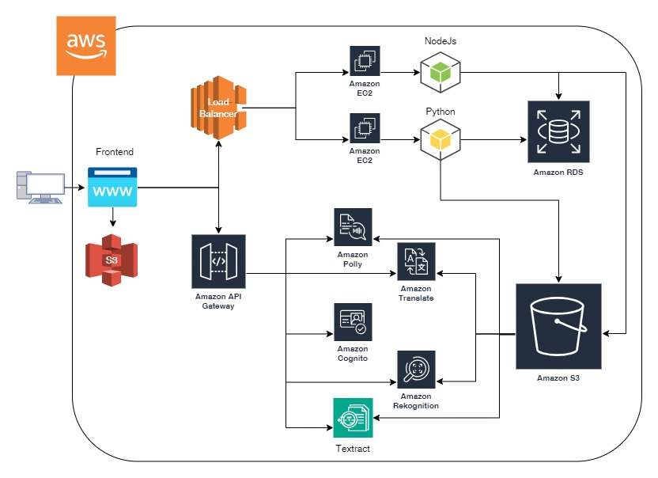
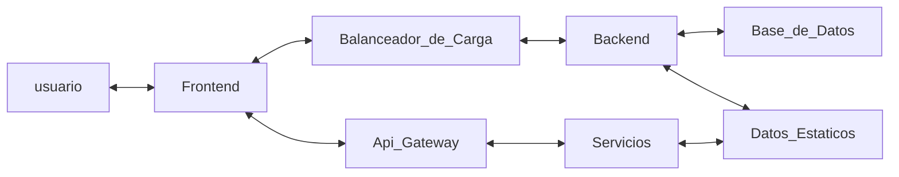
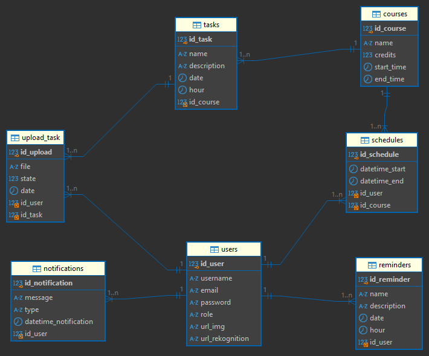
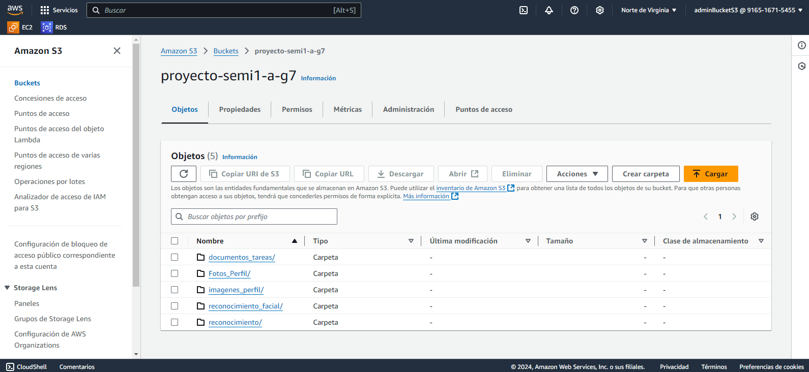
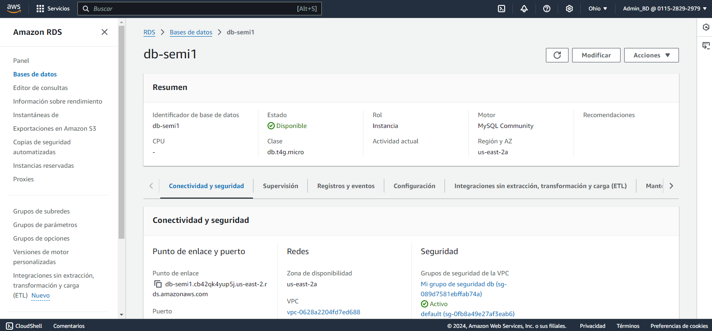
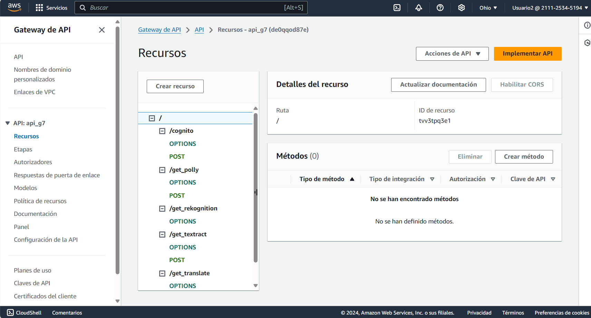
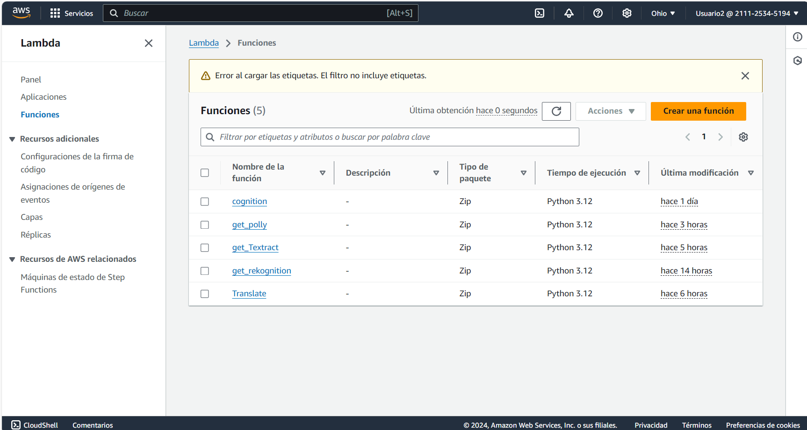

# SEMI1_2S2024_PROYECTO_A_G7
## Objetivos del proyecto:


1. **Facilitar la Gestión del Tiempo**:
   - Desarrollar una interfaz intuitiva que permita a los estudiantes organizar sus horarios de clases, tareas y actividades extracurriculares de manera eficiente.

2. **Implementar Recordatorios**:
   - Crear un sistema de recordatorios que envíe notificaciones oportunas a los estudiantes sobre entregas de tareas
   y recordatorios establecidos por ellos mismos.

3. **Centralizar la Información de Cursos**:
   - Proporcionar un espacio donde los estudiantes puedan acceder a la información de sus cursos, incluyendo materiales de estudio, y fechas importantes, facilitando el seguimiento de su progreso académico.

4. **Organización de Tareas y Proyectos**:
   - Permitir a los estudiantes crear, organizar y priorizar sus tareas y proyectos en función de su urgencia y relevancia, ayudándoles a mantenerse enfocados en sus objetivos académicos.

5. **Analizar el Rendimiento Académico**:
   - Implementar funciones de análisis que permitan a los estudiantes revisar su desempeño en tareas, identificando áreas de mejora y estableciendo metas realistas.

6. **Accesibilidad y Usabilidad**:
   - Diseñar una plataforma accesible que funcione en múltiples dispositivos, garantizando que todos los estudiantes puedan utilizar la aplicación sin barreras tecnológicas.

7. **Integración con Otras Herramientas Educativas**:
   - Facilitar la integración con otras plataformas educativas y herramientas de gestión de aprendizaje, permitiendo a los estudiantes sincronizar su trabajo y datos en un solo lugar.


## Descripcion del Proyecto

El proyecto es una aplicación web moderna que utiliza una infraestructura distribuida basada en Amazon Web Services (AWS). El frontend está desarrollado en React y desplegado en un bucket de S3, lo que proporciona una distribución eficiente y escalable de los archivos estáticos. La aplicación está soportada por dos backends: uno construido en Node.js con Express y otro en Python con Flask, ambos desplegados en una instancia de Amazon EC2. Para garantizar un rendimiento óptimo y alta disponibilidad, se emplea un Load Balancer que distribuye el tráfico del frontend de manera equitativa entre los dos backends.

El almacenamiento y gestión de datos se realizan en una base de datos MySQL alojada en Amazon RDS, proporcionando durabilidad y alta disponibilidad para la información importante. Los archivos estáticos también se almacenan de manera segura en un bucket de S3.

Además, el proyecto utiliza varios servicios avanzados de AWS para agregar funcionalidades clave:

- Amazon Polly: Convierte archivos almacenados en S3 en audio, permitiendo la conversión de texto a voz.

- Amazon Textract: Extrae texto de documentos almacenados en S3 para su procesamiento y análisis.

- Amazon Translate: Traduce textos y archivos almacenados en S3, facilitando la accesibilidad multilingüe.

- Amazon Rekognition: Proporciona capacidades de reconocimiento facial y análisis de imágenes.

- Amazon Cognito: Gestiona y valida cuentas de usuario, incluyendo la verificación de correos electrónicos.

Estos servicios son consumidos por medio de funciones Lambda escritas en Python, integradas con API Gateway, lo que permite la exposición de endpoints RESTful para la comunicación entre servicios y la automatización de procesos clave dentro del sistema.

## Tecnologias Utilizadas en el Desarrollo

- **Lenguajes de Programacion**
    - NodeJS
    - Python

- **Sevicios AWS**
    - Usuarios IAM
    - Bucket S3
    - Amazon Ec2
    - Load Balancer
    - Amazon RDS
    - Funciones Lambda
    - Api Gateway
    - Amazon Polly
    - Amazon Textract
    - Amazon Translate
    - Amazon Rekognition
    - Amazon Cognito
- **Base de Datos**
    - Mysql

- **Herramientas**
    - Visual Studio Code: Edición de Código
    - Mysql Workbench: Administración de Base de Datos
    - Termius: Conexión remota a servidores mediante SSH
    - Github: Servidor de Versionamiento
    - GitKracken: Administración del Versionamiento


## Arquitectura

La arquitectura de la aplicación está basada en servicios REST.




## Flujo de Ejecucion





## Ejecucion 


Para Ejecutar la aplicacion: 

1. Encender los servidores EC2 y validar el direccionamiento load balancer

2. Para levantar el Frontend se debera instalar las dependencias y ejecutar el codigo con los siguientes comandos
    ``` c
	npm install
    npm start
	```
3. Para levantar el Backend de Python debera instalar las dependencias y ejecutar el codigo.
    ``` c
	pip install -r requirements.txt
    python run.py
	```
4. Para levantar el Backend de NodeJs se debera instalar las dependencias y ejecutar el codigo con los siguientes comandos
    ``` c
	npm install
    npm start
	```
> Nota: Ambos servidores de backens de ejecutan en el puerto 5000 y el frontend en el puerto 3000


## Endpoints y Servicios

Para el Despliegue de la aplicacion se utilizo aws y se utilizaron los siguientes endpoints, funciones lambda y servicios


| Tipo | Metodo |Despliegue |Endpoint |Uso |
| ------ | ------ | ------ | ------ | ------ |
| Edpoint | POST | Backend | /login_user  | Logueo de Usuario |
| Edpoint | POST | Backend | /get_user  | Obtenención de Usuario |
| Edpoint | POST | Backend | /create_user  | Creación de Usuario |
| Edpoint | PUT | Backend | /update_user  | Modificación de Usuario |
| Edpoint | DELETE | Backend | /delete_user  | Eliminación de Usuario |
| Edpoint | GET | Backend | /get_users  | Obtención de todos los Usuarios |
| Edpoint | POST | Backend | /create_rekognition  | Guardar imagen Facial |
| Edpoint | POST | Backend | /get_rekognition  | Comparar imagenes Faciales |
| Edpoint | POST | Backend | /create_course  | Crear Curso |
| Edpoint | GET | Backend | /get_all_courses  | Obtener todos los Cursos |
| Edpoint | PUT | Backend | /update_course  | Actualizar Curso |
| Edpoint | DELETE | Backend | /delete_course  | Eliminar Curso |
| Edpoint | POST | Backend | /create_reminder  | Crear Recordatorio |
| Edpoint | PUT | Backend | /modify_reminder  | Modificar Recordatorio |
| Edpoint | DELETE | Backend | /delete_reminder  | Eliminar Recordatorio |
| Edpoint | POST | Backend | /get_reminders_user  | Obtener Recordatorio por Usuario |
| Edpoint | POST | Backend | /create_schedule  | Crear Horario |
| Edpoint | GET | Backend | /get_schedules  | Obtener Horarios |
| Edpoint | POST | Backend | /get_schedule  | Obtener Horarios por id |
| Edpoint | POST | Backend | /get_schedules_by_user  | Obtener Horarios de Usuario |
| Edpoint | PUT | Backend | /update_schedule  | Modificar Horario |
| Edpoint | DELETE | Backend | /delete_schedule  | Eliminar Horario |
| Edpoint | POST | Backend | /get_notifications_user  | Obtener Notificaciones de Usuario |
| Edpoint | GET | Backend | /get_notifications  | Obtener Notificaciones |
| Servicio | POST | Lambda | /cognito  | Utilizar Servicio Cognito |
| Servicio | POST | Lambda | /get_polly  | Utilizar Servicio Polly|
| Servicio | POST | Lambda | /get_rekognition  | Utilizar Servicio Rekognition |
| Servicio | POST | Lambda | /get_textract  | Utilizar Servicio Textract |
| Servicio | POST | Lambda | /get_traslate  | Utilizar Servicio Traslate |

## Base de Datos

Se utilizo una base de datos Relacional alojada en Amazon RDS e instanciada en Mysql, el Modelo Entidad Relacion es el siguiente:




## Anexos de Servicios AWS

1. Bucket S3

    

2. RDS

    

3. Api Gateway

    

4. Lambda

    

5. Ec2

    

6. **Usuarios IAM**

| Usuario | Servicios que administra |
| ------ | ------ | 
| adminEC2 | EC2 y LoadBalancer | 
| adminBucketS3 | Buckets S3 | 
| Usuario2 | ApiGateway y Funciones Lambda | 
| Admin_BD | Almacenamiento RDS | 

>Nota: Para el funcionamiento de la aplicacion todos los servicios deben estar levantados y ejecutados correctamente en AWS.


# Presupuesto del Proyecto: Plataforma de Gestión para Estudiantes

## Resumen del Proyecto
La plataforma de gestión para estudiantes tiene como objetivo facilitar la organización de horarios, recordatorios, cursos y tareas. La aplicación está basada en una infraestructura distribuida utilizando Amazon Web Services (AWS) y tecnologías modernas como React, Node.js y Python.

## Presupuesto Detallado

### 1. **Costos de Desarrollo Inicial**
| Concepto                       | Descripción                                            | Costo Estimado | Tiempo Estimado |
|--------------------------------|--------------------------------------------------------|----------------|------------------|
| **Frontend**                   | Desarrollo en React y diseño UI/UX                    | Q5,000         | 2 semanas        |
| **Backend (Node.js)**          | Desarrollo de API y lógica de negocio                  | Q4,000         | 3 semanas        |
| **Backend (Python/Flask)**     | Desarrollo de API y lógica de negocio                  | Q4,000         | 3 semanas        |
| **Base de Datos (MySQL)**      | Configuración y diseño de base de datos                | Q2,000         | 1 semanas        |
| **Integración AWS**            | Configuración de servicios como S3, RDS, Lambda       | Q3,000         | 1 semanas        |
| **Pruebas y QA**               | Realización de pruebas unitarias y de integración      | Q2,000         | 2 semanas        |
| **Documentación**              | Creación de documentación técnica y de usuario         | Q1,000         | 1 semana         |
| **Total Desarrollo Inicial**    |                                                        | **Q21,000**    | **13 semanas**   |

### 2. **Costos de Infraestructura AWS**
| Servicio                 | Descripción                                        | Costo Mensual Estimado |
|-------------------------|----------------------------------------------------|------------------------|
| **Amazon EC2**          | Servidores virtuales para backend                  | Q150                   |
| **Amazon S3**          | Almacenamiento de archivos estáticos                | Q50                    |
| **Amazon RDS**         | Base de datos relacional                             | Q100                   |
| **Amazon Lambda**      | Funciones serverless para procesamiento             | Q30                    |
| **API Gateway**        | Gestión de APIs y control de acceso                 | Q20                    |
| **Total Infraestructura AWS** |                                           | **Q350**               |

### 3. **Costos Operativos**
| Concepto                        | Descripción                                          | Costo Mensual Estimado |
|---------------------------------|-----------------------------------------------------|------------------------|
| **Mantenimiento de Software**    | Actualizaciones y corrección de errores              | Q500                   |
| **Soporte Técnico**              | Atención al usuario y solución de problemas          | Q300                   |
| **Marketing y Promoción**        | Estrategias de marketing para atraer usuarios        | Q400                   |
| **Total Costos Operativos**      |                                                    | **Q1,200**             |

### 4. **Mejoras Futuras (Propuestas)**
| Mejora                       | Descripción                                           | Costo Estimado | Tiempo Estimado |
|-----------------------------|-------------------------------------------------------|----------------|------------------|
| **Funcionalidad Multilingüe**| Implementación de traducción automática para la plataforma | Q2,000         | 1 semanas        |
| **Integración con otras herramientas**| Sincronización con plataformas educativas y de aprendizaje | Q3,000         | 2 semanas        |
| **Análisis de Rendimiento Académico**| Implementación de un sistema de análisis de datos      | Q2,500         | 2 semanas        |
| **Total Mejoras Futuras**   |                                                       | **Q7,500**     | **5 semanas**   |

## Resumen Total
- **Costo Total de Desarrollo Inicial:** Q21,000
- **Costo Mensual de Infraestructura AWS:** Q350
- **Costo Mensual de Operaciones:** Q1,200
- **Costo Estimado para Mejoras Futuras:** Q7,500

### Tiempo Total Estimado para Desarrollo Inicial: 13 semanas
### Tiempo Estimado para Mejoras Futuras: 5 semanas

## Funciones Lambda Utilizadas

### 1. Función **Textract**
AWS Textract es un servicio que permite extraer texto, formularios y tablas de documentos escaneados de manera automática. Utiliza aprendizaje automático para identificar y extraer información estructurada y no estructurada.

#### Utilidad en un programa para estudiantes:
- **Subida de documentos**: Los estudiantes pueden cargar documentos como trabajos, ensayos o formularios. Textract puede procesar estos documentos y extraer texto relevante, facilitando su revisión y análisis.
- **Análisis de formularios**: En el caso de formularios de inscripción, Textract puede extraer automáticamente información como nombres, fechas y otros datos necesarios, reduciendo el esfuerzo manual.
- **Búsqueda y recuperación de información**: Con el texto extraído, se pueden implementar funciones de búsqueda en un portal de estudiantes, permitiendo que encuentren información específica en documentos de manera rápida y eficiente.

### 2. Función **Translate**
AWS Translate es un servicio de traducción automática que permite traducir texto en múltiples idiomas.

#### Utilidad en un programa para estudiantes:
- **Accesibilidad**: Permite a los estudiantes de diferentes orígenes lingüísticos acceder a materiales de estudio en su idioma preferido, promoviendo la inclusión y la diversidad.
- **Mejora del aprendizaje**: Los estudiantes pueden traducir textos académicos, ayudándoles a entender mejor conceptos complejos en su lengua materna.

### 3. Función **Cognito**
Amazon Cognito es un servicio que facilita la autenticación de usuarios y la gestión de identidades. Permite a los desarrolladores agregar registro, inicio de sesión y control de acceso a sus aplicaciones.

#### Utilidad en un programa para estudiantes:
- **Gestión de usuarios**: Facilita la creación de cuentas para estudiantes y la gestión de su información personal y preferencias, proporcionando un acceso seguro a la plataforma.
- **Sincronización de datos**: Permite a los estudiantes acceder a sus datos desde diferentes dispositivos, mejorando la experiencia del usuario.

### 4. Función **Polly**
AWS Polly es un servicio de conversión de texto a voz que permite generar audio realista a partir de texto escrito.

#### Utilidad en un programa para estudiantes:
- **Aprendizaje inclusivo**: Puede ser utilizado para leer en voz alta materiales de estudio, ayudando a estudiantes con discapacidades visuales o dificultades de lectura.
- **Práctica de idiomas**: Los estudiantes pueden escuchar textos en diferentes idiomas, mejorando su pronunciación y comprensión oral.

