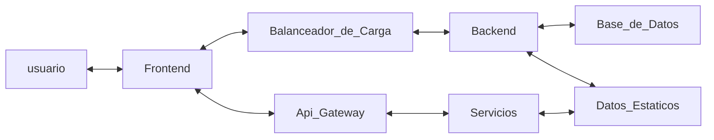

# SEMI1_2S2024_PROYECTO_A_G7


## Descripcion del Proyecto

El proyecto es una aplicación web moderna que utiliza una infraestructura distribuida basada en Amazon Web Services (AWS). El frontend está desarrollado en React y desplegado en un bucket de S3, lo que proporciona una distribución eficiente y escalable de los archivos estáticos. La aplicación está soportada por dos backends: uno construido en Node.js con Express y otro en Python con Flask, ambos desplegados en una instancia de Amazon EC2. Para garantizar un rendimiento óptimo y alta disponibilidad, se emplea un Load Balancer que distribuye el tráfico del frontend de manera equitativa entre los dos backends.

El almacenamiento y gestión de datos se realizan en una base de datos MySQL alojada en Amazon RDS, proporcionando durabilidad y alta disponibilidad para la información importante. Los archivos estáticos también se almacenan de manera segura en un bucket de S3.

Además, el proyecto utiliza varios servicios avanzados de AWS para agregar funcionalidades clave:

- Amazon Polly: Convierte archivos almacenados en S3 en audio, permitiendo la conversión de texto a voz.

- Amazon Textract: Extrae texto de documentos almacenados en S3 para su procesamiento y análisis.

- Amazon Translate: Traduce textos y archivos almacenados en S3, facilitando la accesibilidad multilingüe.

- Amazon Rekognition: Proporciona capacidades de reconocimiento facial y análisis de imágenes.

- Amazon Cognito: Gestiona y valida cuentas de usuario, incluyendo la verificación de correos electrónicos.

Estos servicios son consumidos por medio de funciones Lambda escritas en Python, integradas con API Gateway, lo que permite la exposición de endpoints RESTful para la comunicación entre servicios y la automatización de procesos clave dentro del sistema.

## Tecnologias Utilizadas en el Desarrollo

- **Lenguajes de Programacion**
    - NodeJS
    - Python

- **Sevicios AWS**
    - Usuarios IAM
    - Bucket S3
    - Amazon Ec2
    - Load Balancer
    - Amazon RDS
    - Funciones Lambda
    - Api Gateway
    - Amazon Polly
    - Amazon Textract
    - Amazon Translate
    - Amazon Rekognition
    - Amazon Cognito
- **Base de Datos**
    - Mysql

- **Herramientas**
    - Visual Studio Code: Edición de Código
    - Mysql Workbench: Administración de Base de Datos
    - Termius: Conexión remota a servidores mediante SSH
    - Github: Servidor de Versionamiento
    - GitKracken: Administración del Versionamiento


## Arquitectura

La arquitectura de la aplicación está basada en servicios REST.


## Flujo de Ejecucion





## Ejecucion 


Para Ejecutar la aplicacion: 

1. Encender los servidores EC2 y validar el direccionamiento load balancer

2. Para levantar el Frontend se debera instalar las dependencias y ejecutar el codigo con los siguientes comandos
    ``` c
	npm install
    npm start
	```
3. Para levantar el Backend de Python debera instalar las dependencias y ejecutar el codigo.
    ``` c
	pip install -r requirements.txt
    python run.py
	```
4. Para levantar el Backend de NodeJs se debera instalar las dependencias y ejecutar el codigo con los siguientes comandos
    ``` c
	npm install
    npm start
	```
> Nota: Ambos servidores de backens de ejecutan en el puerto 5000 y el frontend en el puerto 3000


## Endpoints y Servicios

Para el Despliegue de la aplicacion se utilizo aws y se utilizaron los siguientes endpoints, funciones lambda y servicios


| Tipo | Metodo |Despliegue |Endpoint |Uso |
| ------ | ------ | ------ | ------ | ------ |
| Edpoint | POST | Backend | /login_user  | Logueo de Usuario |
| Edpoint | POST | Backend | /get_user  | Obtenención de Usuario |
| Edpoint | POST | Backend | /create_user  | Creación de Usuario |
| Edpoint | PUT | Backend | /update_user  | Modificación de Usuario |
| Edpoint | DELETE | Backend | /delete_user  | Eliminación de Usuario |
| Edpoint | GET | Backend | /get_users  | Obtención de todos los Usuarios |
| Edpoint | POST | Backend | /create_rekognition  | Guardar imagen Facial |
| Edpoint | POST | Backend | /get_rekognition  | Comparar imagenes Faciales |
| Edpoint | POST | Backend | /create_course  | Crear Curso |
| Edpoint | GET | Backend | /get_all_courses  | Obtener todos los Cursos |
| Edpoint | PUT | Backend | /update_course  | Actualizar Curso |
| Edpoint | DELETE | Backend | /delete_course  | Eliminar Curso |
| Edpoint | POST | Backend | /create_reminder  | Crear Recordatorio |
| Edpoint | PUT | Backend | /modify_reminder  | Modificar Recordatorio |
| Edpoint | DELETE | Backend | /delete_reminder  | Eliminar Recordatorio |
| Edpoint | POST | Backend | /get_reminders_user  | Obtener Recordatorio por Usuario |
| Edpoint | POST | Backend | /create_schedule  | Crear Horario |
| Edpoint | GET | Backend | /get_schedules  | Obtener Horarios |
| Edpoint | POST | Backend | /get_schedule  | Obtener Horarios por id |
| Edpoint | POST | Backend | /get_schedules_by_user  | Obtener Horarios de Usuario |
| Edpoint | PUT | Backend | /update_schedule  | Modificar Horario |
| Edpoint | DELETE | Backend | /delete_schedule  | Eliminar Horario |
| Edpoint | POST | Backend | /get_notifications_user  | Obtener Notificaciones de Usuario |
| Edpoint | GET | Backend | /get_notifications  | Obtener Notificaciones |
| Servicio | POST | Lambda | /cognito  | Utilizar Servicio Cognito |
| Servicio | POST | Lambda | /get_polly  | Utilizar Servicio Polly|
| Servicio | POST | Lambda | /get_rekognition  | Utilizar Servicio Rekognition |
| Servicio | POST | Lambda | /get_textract  | Utilizar Servicio Textract |
| Servicio | POST | Lambda | /get_traslate  | Utilizar Servicio Traslate |

## Base de Datos

Se utilizo una base de datos Relacional alojada en Amazon RDS e instanciada en Mysql, el Modelo Entidad Relacion es el siguiente:


## Anexos de Servicios AWS

1. Bucket S3

    

2. RDS

    

3. Api Gateway

    

4. Lambda

    

5. Ec2

    

6. **Usuarios IAM**

| Usuario | Servicios que administra |
| ------ | ------ | 
| adminEC2 | EC2 y LoadBalancer | 
| adminBucketS3 | Buckets S3 | 
| Usuario2 | ApiGateway y Funciones Lambda | 
| Admin_BD | Almacenamiento RDS | 

>Nota: Para el funcionamiento de la aplicacion todos los servicios deben estar levantados y ejecutados correctamente en AWS.