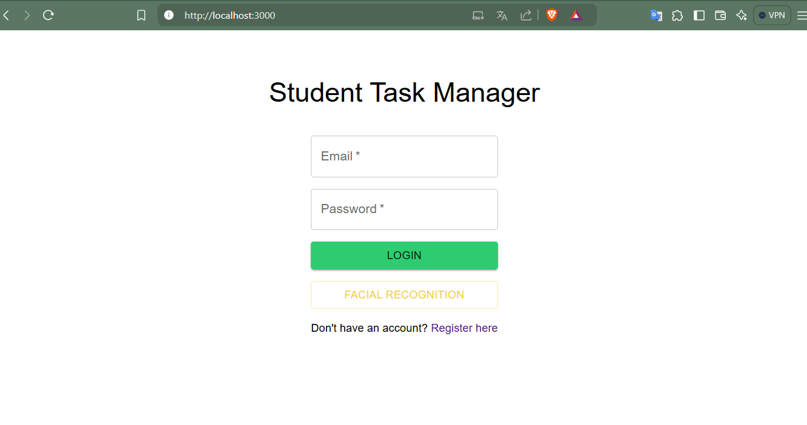

# Manual de Usuario:




# AWS CLOUD INNOVATION

## DESCRIPCION

Actualmente existen diversas formas y situaciones donde se necesita e implementan los

servicios de la nube, como estudiantes de Seminario de sistemas 1 y teniendo los

conocimientos básicos de diferentes servicios que nos brinda AWS se requiere que defina,

desarrolle e implemente un proyecto innovador utilizando los servicios de la nube.

Servicio de gestión de datos estudiantiles, el cual permite administrar tu horario

de estudio, además de contar con diversas herramientas que hacen la vida de un

estudiante más fácil, tal como un conversor de documentos de diversos idiomas,

o manejo de tareas, actividades y recordatorios, y otras herramientas

estudiantiles innovadoras.

## Objetivos:

General:

- Cloud permite la innovación a través del acceso a nuevas tecnologías de forma

rápida, segura y fácil.

Específicos:

- Aplicar los conocimientos adquiridos tanto de la clase magistral y el laboratorio.

- Implementar una arquitectura utilizando servicios en la nube. o Integrar servicios de

AWS .

- Aplicar las tecnologías de la nube a un entorno real.

# Requisitos previos para el usuario:

Conocimientos basicos de una interfaz web , manejo de pestañas y de sistemas básicos como Login, llenado de formularios y credenciales.

## Detalles Software y Hardware necesario:

Versiones Usadas:

FRONTEND:

```json
"version": "0.1.0",
  "private": true,
  "dependencies": {
    "@emotion/react": "^11.13.3",
    "@emotion/styled": "^11.13.0",
    "@mui/icons-material": "^6.1.3",
    "@mui/material": "^6.1.3",
    "@testing-library/jest-dom": "^5.17.0",
    "@testing-library/react": "^13.4.0",
    "@testing-library/user-event": "^13.5.0",
    "axios": "^1.7.7",
    "react": "^18.3.1",
    "react-dom": "^18.3.1",
    "react-router-dom": "^6.26.2",
    "react-scripts": "5.0.1",
    "web-vitals": "^2.1.4"
  }
```

BACKEND:

```json
  "dependencies": {
    "@aws-sdk/client-rekognition": "^3.654.0",
    "@aws-sdk/client-s3": "^3.637.0",
    "@aws-sdk/client-translate": "^3.654.0",
    "aws-sdk": "^2.1685.0",
    "bcrypt": "^5.1.1",
    "cors": "^2.8.5",
    "dotenv": "^16.4.5",
    "express": "^4.19.2",
    "morgan": "^1.10.0",
    "multer": "^1.4.5-lts.1",
    "mysql2": "^3.11.0",
    "nodemon": "^3.1.4"
  }
```

## Instalación

```json
>cd direccionProyecto
>npm install
>npm start 
```

## Interfaz de Usuario:


registro de usuario

Se debe de ingresar Nombre de Usuario

El correo del usuario

La contraseña (debe ser guardada por que no se recordara luego)

Imagen de perfil se activar la camara y se podra subir la imagen

Boton de Registro para enviar los datos al sistema.


Home

Se veran los curso existentes actualmente  asi como los recordatorios 

Arriba un panel de inicio (si eres admin podras ver mas opciones se explicaran adelante)

El link de INICIO nos redigira a home

el link Crear Cursos  no redirigira a la pestaña para crear cursos

el link Usuarios nos redirigira a ver los usuarios 

el link ver perfil nos redirigira a la pestaña par ver nuestros datos de cuenta 


cursesAdmin

aqui podremos editar los usuarois , al crear podremos llenar los campos

para crear nuestro curso , el nombre, creditos, tiempo inicio y tiempo final del curso

mas habajo podremos editar los cusos ,se nos habrira una pestaña para agregar o cambiar los datos de cada curso.

y tambien eliminar un curso.


taskAdmin

Aqui podremos editar las tareas asignadas para el usuario

4 campos para ingresar datos, en este caso el nombre, descripcion, la fecha , la hora de la tarea y el curso asociado con la tarea 

el boton crear tarea presionamos cuando ya esten llenos los campos para crear la tarea

Modificar la tarea 

podremos modificar cada tarea actualizando los campos dependiendo cual tengamos asignado 

al terminar de modificar presionamos para actualizar la tarea.


Aqui podremos administrar los usuario.

ya sea ingresando un nombre, el email, la contraseña de este subir la imagen del usuario.

upload image para subir la imagen a la nube y guardarla en la base de datos. 

el boton crete user al momento de llenar los cambios presionamos para crear el usuario.


perfil Admin

Boton subir imagen: aqui podremos tnto cargar una nueva imagen en el boton

tomar foto: para tomar una foto y subirla al sistema

cerrar secion para salirnos del usuario y el sitema que puede manejar.


para ingrear al sitema se pedira el email y una contraseña ademas del reconocimiento facial

login: al presionar nos dejara ingresar al sistema.


En functions:

Podemos subir nuestro archivo para cargar en el boton Cargar

Funcion translate:

traducimos segun la caja de texto y al precionar nuestro boton traducir corremos el servicio

funcion textract:

subimos nuestro texto o archivo par substraer lo que necesitamos

extraer texto el boton nos ayudara a extraer los elementos del texto que necesitamos para que 

Funcion Poly:

ingresamos nuestro texto o cargamos el archivo

generar audio: generamos el audio por medio del servicio y lo reproducimos.